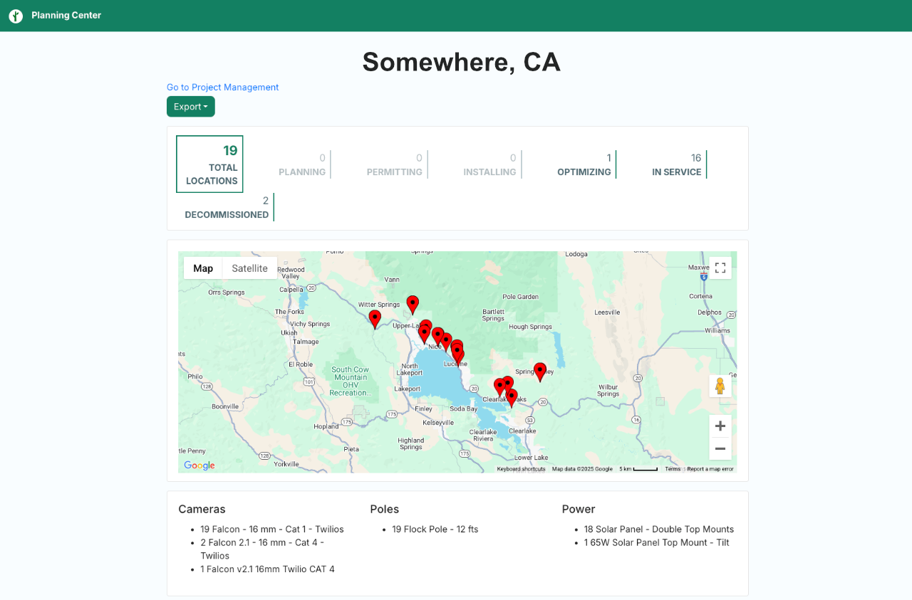

# Flock OSM Importer

This simple script is used to import Flock Planning Center data into the OSM database.



### What is Flock Planning Center
Flock Planning Center is a webpage given to Flock's customers for managing their deployment. It includes detailed information about the devices, their status, and their locations.

### Where Can I Find Flock Planning Center URLs?
Flock Planning Center links are usually only shared with Flock's customers, but they can be obtained through Google Dorking and FOIA requests.

The planning center url scheme is:
```
https://planner.flocksafety.com/public/SOME-LONG-UUID
```

The UUID is unique to each customer.

## How to Use

### 1. Register a Client Application with OSM

1. Go to [My Client Applications](https://www.openstreetmap.org/oauth2/applications) in OSM.
2. Click on `Register a new application`.
3. Fill in the details:
   - `Name`: Flock OSM Importer
   - `Redirect URI`: https://cdn.deflock.me/echo.html
   - `Permissions`:
      - `Modify the map`

4. Click on `Register`. Make note of the `Client ID` and `Client Secret`. The secret will only be shown once.
5. Rename `.env.example` to `.env`, and paste in the `Client ID` and `Client Secret`.

### 2. Clone the repository

```bash
git clone https://github.com/frillweeman/flock-osm-importer
```

### 3. Install the requirements

```bash
cd flock-osm-importer
. ./.venv/bin/activate
pip install -r requirements.txt
```

### 4. Run the script

> **WARNING**: Before running in production, please test this script in the OSM dev environment. To do so, you'll need to repeat [Step 1](#1-register-a-client-application-with-osm) on the [development site](https://master.apis.dev.openstreetmap.org/oauth2/applications), and then run `export ENV=dev` before running the script.

```bash
python3 import.py "<flock-planner-url>"
```

The script will open a browser window asking you to authorize the application. After you authorize the application, the script will start importing the data into a changeset.

When the changeset is created, the script will open the changeset in a browser window. You can then review the changes and submit them to OSM by responding `Y` to the prompt.

#### Sample Output
```bash
$ python3 import.py "https://planner.flocksafety.com/public/xxx-yyy-zzz"
Running in dev environment
No cached access token found. Generating new token...
Opening browser to authorize access to OSM API...
Paste the authorization code here: ********
Changeset created with ID: 398647
Nodes uploaded successfully.
Please review changeset: https://master.apis.dev.openstreetmap.org/browse/changeset/398642
Do you approve these changes? [y/N]: y
Changeset 398647 closed successfully.
```
